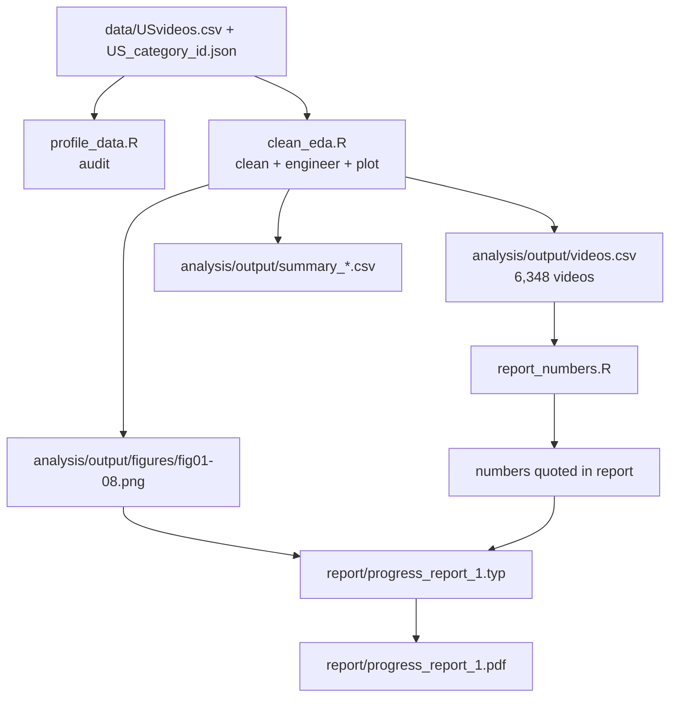

# Code Map — Progress Report 1 (R)

A quick orientation for anyone (hi Janna 👋) opening this project for the first time.
It explains what every folder and file does, how the pieces connect, and how to
reproduce the report. The analysis is written in **R**.

---

## TL;DR — how to run everything

Prerequisite: **R** (4.x) with the `tidyverse`, `lubridate`, `jsonlite`, `digest`,
`scales`, `patchwork`, and `e1071` packages, plus `typst` to rebuild the PDF. Install
the packages once with:

```r
install.packages(c("tidyverse", "lubridate", "jsonlite", "digest", "scales",
                   "patchwork", "e1071"))
```

(The project also ships a Nix flake for the Linux dev machine; that is optional — see
the environment note at the end.)

```sh
# 0. Fetch the raw data into ./data (skips if the files are already there)
Rscript analysis/download_data.R

# 1. Audit the raw data (prints stats to the terminal; changes nothing)
Rscript analysis/profile_data.R

# 2. Clean + engineer features + write summary tables + EDA figures
Rscript analysis/clean_eda.R

# 3. Print the exact numbers quoted in the report
Rscript analysis/report_numbers.R

# 4. Build the PDF from the report source
typst compile --root . report/progress_report_1.typ report/progress_report_1.pdf
```

Steps 1–3 need the raw CSVs in `data/` (step 0 fetches them; see `data/README.md`).
Step 4 needs the figures in `report/figures/`.

---

## Where everything lives

```text
project/
├─ data/                          Raw Kaggle files (gitignored) + README
│  ├─ USvideos.csv                   40,949 rows x 16 cols  (the main input)
│  ├─ US_category_id.json            category-id -> name map
│  ├─ <other regions>.csv/.json      present but unused for now
│  └─ README.md                      source, inventory, SHA-256 checksums
│
├─ docs/                          Assignment + our write-ups
│  ├─ proposal.txt                   the project proposal (text copy)
│  └─ progRept1/                     Progress Report 1 material
│     ├─ specifications.md              the milestone spec
│     ├─ specifications_review.md       our validation of that spec
│     ├─ CODE_MAP.md                    this file
│     ├─ transition.md                  archived planning notes
│     └─ r_port_plan.md                 archived execution log
│
├─ analysis/                      All the R
│  ├─ download_data.R               Step 0: fetch the raw data into ./data
│  ├─ profile_data.R                Step 1: audit the raw file
│  ├─ clean_eda.R                   Step 2: clean, engineer, plot
│  ├─ report_numbers.R              Step 3: summary numbers for the report
│  └─ output/                       Generated data tables (gitignored)
│     ├─ videos.csv                  the cleaned video-level analysis table
│     ├─ summary_*.csv               numeric summaries used in the report
│     ├─ cleaning_log.txt            row counts at each cleaning step
│     └─ figures/                    R-rendered fig01..08 (parity check copies)
│
├─ report/                        The deliverable
│  ├─ progress_report_1.typ          report source (Typst markup)
│  ├─ progress_report_1.pdf          compiled Progress Report 1
│  └─ figures/                       fig01..fig08 embedded in the report
│
├─ .gitignore                     excludes raw data + generated outputs
├─ flake.nix / flake.lock         dev-environment definitions
└─ .envrc                         direnv hook ("use flake")
```

> **Note on figures.** `report/figures/` holds the figures embedded in the report.
> `clean_eda.R` writes the same eight figures to `analysis/output/figures/` when run.

---

## Data flow



`clean_eda.R` is the heart of the pipeline: it reads the raw CSV, produces the clean
video-level table, and writes the figures. The report is just text + those figures.

---

## Script reference

| Script | What it does | Reads | Writes |
|---|---|---|---|
| `analysis/download_data.R` | Fetches the Kaggle dataset into `data/` (HTTPS or a local zip) and verifies checksums | network / zip | `data/*.csv`, `data/*.json` |
| `analysis/profile_data.R` | Data audit: dimensions, dtypes, date ranges, missingness, duplicates, skew, flag counts, category distribution, logical checks | `data/USvideos.csv`, `data/US_category_id.json` | (stdout only) |
| `analysis/clean_eda.R` | Cleaning pipeline, feature engineering, dedup to video level, 8 EDA figures, summary CSVs | `data/USvideos.csv`, `data/US_category_id.json` | `analysis/output/*` |
| `analysis/report_numbers.R` | Prints the compact set of statistics cited in the report | `analysis/output/videos.csv` | (stdout only) |

### `download_data.R` (Step 0 — fetch)
Downloads the dataset and drops the `*videos.csv` / `*_category_id.json` files flat into
`data/`. A local zip can be supplied with `--from-zip`. It is idempotent (skips when the
files are present) and checksum-verifies the two US files with `digest::digest()`.
Public dataset — no Kaggle account required.

### `profile_data.R` (Step 1 — audit)
Answers "what is in this file before we touch it?" It verifies the shape (40,949 × 16),
parses both date columns, counts missing/sentinel values (`[none]` tags), finds
duplicate rows and repeated `video_id`s, and reports skewness of the count columns. Run
it first if you ever doubt the data.

> Skewness note: we report the bias-corrected sample skewness (Fisher-Pearson g1), which is
> `e1071::skewness(..., type = 2)`. `e1071`'s *default* is `type = 3`, so the type is always
> passed explicitly.

### `clean_eda.R` (Step 2 — the pipeline)
In order, it:
1. Parses `trending_date` (format `YY.DD.MM`) and `publish_time` (UTC).
2. Drops `video_error_or_removed` rows, exact duplicates, and duplicate video-days.
3. Engineers features: `publish_hour`, `publish_dayofweek`, `title_length`,
   `title_word_count`, `tag_count` (with `[none]` -> 0), `category`, and `days_to_trend`.
4. Adds `log1p` responses and engagement ratios, and the `high_views` label
   (top-quartile views).
5. Collapses to **one row per video** (its last trending snapshot) -> `videos.csv`.
6. Saves summary CSVs and draws `fig01`–`fig08` into `analysis/output/figures/`.

### `report_numbers.R` (Step 3 — numbers)
A small read-out script so the report's numbers are easy to re-check: engagement-ratio
summaries, correlations with `log_views`, `days_to_trend` extremes, flag counts, and so
on.

---

## Outputs reference

`analysis/output/`
- `videos.csv` — the **video-level** analysis table (n = 6,348). One row per video;
  this is what Progress Report 2 will model.
- `summary_cleaning_counts.csv` — rows remaining after each cleaning step.
- `summary_numeric.csv` — describe + skew for the count outcomes.
- `summary_by_category.csv`, `summary_by_hour.csv`, `summary_by_dow.csv` — grouped means.
- `cleaning_log.txt` — the run log from `clean_eda.R`.
- `figures/` — the eight EDA figures written by `clean_eda.R`.

`report/figures/`
- `fig01` raw views vs `log(1+views)`; `fig02` views by category; `fig03` engagement
  ratios by category; `fig04` comment/rating flags; `fig05` publish hour & day;
  `fig06` title length & tag count; `fig07` correlation heatmap; `fig08` class balance
  and snapshot multiplicity.

---

## Key variables to know

| Name | Meaning |
|---|---|
| `log_views`, `log_likes`, `log_dislikes`, `log_comments` | `log(1 + x)` of the raw counts (fixes heavy skew) |
| `like_rate`, `comment_rate`, `dislike_rate` | count / views engagement ratios |
| `high_views` | 1 if final views are in the top quartile (>= 1,473,578), else 0 |
| `publish_hour`, `publish_dayofweek` | from `publish_time` (UTC!) |
| `title_length`, `title_word_count`, `tag_count` | text-derived features |
| `days_to_trend` | `trending_date` − `publish_time` (reveals late-resurfacing videos) |

---

## Gotchas and conventions

These are the "don't trip here" rules baked into the code and the report:

- **Unit of analysis.** The raw file is daily snapshots; the model table is one row per
  **video** (`videos.csv`). Never model the raw 40,949 rows directly.
- **Leakage.** `likes`, `dislikes`, and `comment_count` correlate 0.79–0.87 with `views`
  because they accumulate together. They are **not** allowed as predictors of views.
  Progress Report 2 must use upload-time metadata only.
- **Grouped CV.** Videos repeat and channels recur, so cross-validation must be grouped
  by `video_id` / `channel_title` (see the report's modeling plan).
- **Date format** is `YY.DD.MM`; **time** is UTC (so `publish_hour` is not US-local).
- **Tag sentinel** `[none]` means zero tags.
- **Day of week** is coded Monday = 0 … Sunday = 6: in R,
  `lubridate::wday(x, week_start = 1) - 1`, since `wday()` is Sunday = 1 by default.

---

## Environment note (optional Nix flake)

The repo also ships a Nix flake (`flake.nix`) and a direnv `.envrc`, used on the Linux
dev machine to pin R and every package: run `nix develop`, or just `cd` into the repo
with direnv installed. This is **optional** — on macOS or any system without Nix,
install R and the packages directly (see the TL;DR above). If you do edit `flake.nix`,
reload the environment (`direnv reload`, or re-enter `nix develop`).

---

## Where to look next

- **Want the reasoning behind the report?** Read `docs/progRept1/specifications_review.md`
  — it lists every gap we fixed (unit of analysis, leakage, grouped CV, inference model,
  the `[none]` sentinel, etc.).
- **Ready to model?** Progress Report 2 will build on `analysis/output/videos.csv`:
  grouped/nested cross-validation, the regression / tree / classification model families,
  and the robust-standard-error inference model described in the report's Section 6.
