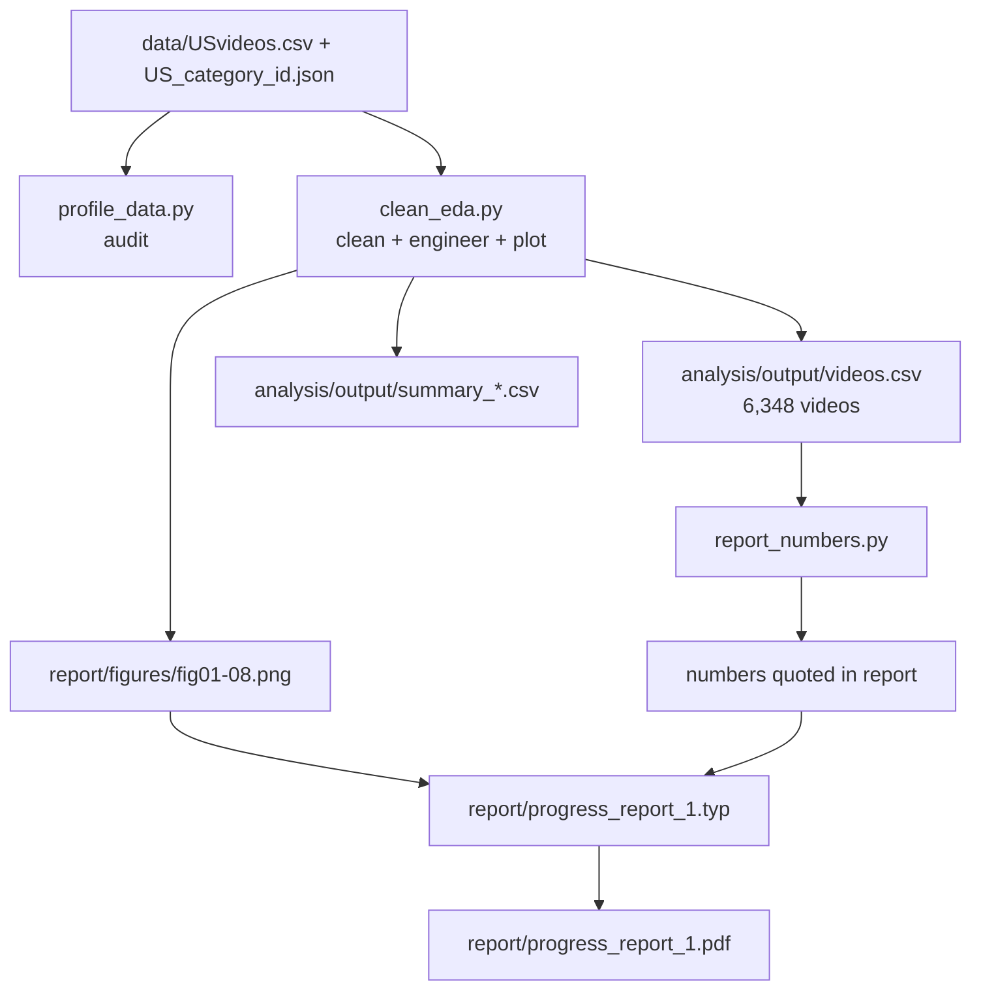

# Code Map — Progress Report 1

A quick orientation for anyone (hi Janna 👋) opening this project for the first time.
It explains what every folder and file does, how the pieces connect, and how to
reproduce the report.

---

## TL;DR — how to run everything

Prerequisite: **Python 3.12** with `pandas`, `numpy`, `matplotlib`, `seaborn`,
`scipy`, and `scikit-learn` (already installed on this machine). `typst` is used to
build the PDF.

```sh
# 0. Fetch the raw data into ./data (skips if the files are already there)
python analysis/download_data.py

# 1. Audit the raw data (prints stats to the terminal; changes nothing)
python analysis/profile_data.py

# 2. Clean + engineer features + write all EDA figures
python analysis/clean_eda.py

# 3. Print the exact numbers quoted in the report
python analysis/report_numbers.py

# 4. Build the PDF from the report source
typst compile --root . report/progress_report_1.typ report/progress_report_1.pdf
```

Steps 1–3 need the raw CSVs in `data/` (step 0 fetches them; see `data/README.md`).
Step 4 needs the figures from step 2.

---

## Where everything lives

```text
project/
├─ data/                          Raw Kaggle files (gitignored) + README
│  ├─ USvideos.csv                   40,949 rows x 16 cols  (the main input)
│  ├─ US_category_id.json            category-id -> name map
│  ├─ <other regions>.csv/.json      present but unused for now
│  └─ README.md                      source, inventory, SHA-256 checksums
│
├─ docs/                          Assignment + our write-ups
│  ├─ proposal.txt                   the project proposal (text copy)
│  └─ progRept1/                     Progress Report 1 material
│     ├─ specifications.md              another agent's execution plan
│     ├─ specifications_review.md       OUR validation of that plan (read this!)
│     └─ CODE_MAP.md                    this file
│
├─ analysis/                      All the Python
│  ├─ download_data.py               Step 0: fetch the raw data into ./data
│  ├─ profile_data.py                Step 1: audit the raw file
│  ├─ clean_eda.py                   Step 2: clean, engineer, plot
│  ├─ report_numbers.py              Step 3: summary numbers for the report
│  └─ output/                        Generated data tables (gitignored)
│     ├─ videos.csv                  the cleaned video-level analysis table
│     ├─ summary_*.csv               numeric summaries used in the report
│     └─ cleaning_log.txt            row counts at each cleaning step
│
├─ report/                        The deliverable
│  ├─ progress_report_1.typ          report source (Typst markup)
│  ├─ progress_report_1.pdf          compiled Progress Report 1
│  └─ figures/                       fig01..fig08 (generated by clean_eda.py)
│
├─ .gitignore                     excludes raw data + generated outputs
├─ flake.nix / flake.lock         dev-environment definitions (see note below)
└─ .envrc                         direnv hook ("use flake")
```

---

## Data flow



`clean_eda.py` is the heart of the pipeline: it reads the raw CSV, produces the clean
video-level table, and writes the figures. The report is just text + those figures.

---

## Script reference

| Script | What it does | Reads | Writes |
|---|---|---|---|
| `analysis/download_data.py` | Fetches the Kaggle dataset into `data/` (kagglehub, HTTPS, or a local zip) and verifies checksums | network / zip | `data/*.csv`, `data/*.json` |
| `analysis/profile_data.py` | Data audit: dimensions, dtypes, date ranges, missingness, duplicates, skew, flag counts, category distribution, logical checks | `data/USvideos.csv`, `data/US_category_id.json` | (stdout only) |
| `analysis/clean_eda.py` | Cleaning pipeline, feature engineering, dedup to video level, 8 EDA figures, summary CSVs | `data/USvideos.csv`, `data/US_category_id.json` | `analysis/output/*`, `report/figures/*` |
| `analysis/report_numbers.py` | Prints the compact set of statistics cited in the report | `analysis/output/videos.csv` | (stdout only) |

### `download_data.py` (Step 0 — fetch)
Downloads the dataset and drops the `*videos.csv` / `*_category_id.json` files flat into
`data/`. Tries `kagglehub` if installed, otherwise a plain HTTPS download; a local zip can
be supplied with `--from-zip`. It is idempotent (skips when the files are present) and
checksum-verifies the two US files. No third-party packages required.

### `profile_data.py` (Step 1 — audit)
Answers "what is in this file before we touch it?" It verifies the shape (40,949 x 16),
parses both date columns, counts missing/sentinel values (`[none]` tags), finds
duplicate rows and repeated `video_id`s, and reports skewness of the count columns. Run
it first if you ever doubt the data.

### `clean_eda.py` (Step 2 — the pipeline)
In order, it:
1. Parses `trending_date` (format `YY.DD.MM`) and `publish_time` (UTC).
2. Drops `video_error_or_removed` rows, exact duplicates, and duplicate video-days.
3. Engineers features: `publish_hour`, `publish_dayofweek`, `title_length`,
   `title_word_count`, `tag_count` (with `[none]` -> 0), `category`, and `days_to_trend`.
4. Adds `log1p` responses and engagement ratios, and the `high_views` label
   (top-quartile views).
5. Collapses to **one row per video** (its last trending snapshot) -> `videos.csv`.
6. Saves summary CSVs and draws `fig01`–`fig08`.

### `report_numbers.py` (Step 3 — numbers)
A small read-out script so the report's numbers are easy to re-check: engagement-ratio
summaries, correlations with `log_views`, `days_to_trend` extremes, flag counts, and so
on.

---

## Outputs reference

`analysis/output/`
- `videos.csv` — the **video-level** analysis table (n = 6,348). One row per video;
  this is what Progress Report 2 will model.
- `summary_cleaning_counts.csv` — rows remaining after each cleaning step.
- `summary_numeric.csv` — describe + skew for the count outcomes.
- `summary_by_category.csv`, `summary_by_hour.csv`, `summary_by_dow.csv` — grouped means.
- `cleaning_log.txt` — the run log from `clean_eda.py`.

`report/figures/`
- `fig01` raw views vs `log(1+views)`; `fig02` views by category; `fig03` engagement
  ratios by category; `fig04` comment/rating flags; `fig05` publish hour & day;
  `fig06` title length & tag count; `fig07` correlation heatmap; `fig08` class balance
  and snapshot multiplicity.

---

## Key variables to know

| Name | Meaning |
|---|---|
| `log_views`, `log_likes`, `log_dislikes`, `log_comments` | `log(1 + x)` of the raw counts (fixes heavy skew) |
| `like_rate`, `comment_rate`, `dislike_rate` | count / views engagement ratios |
| `high_views` | 1 if final views are in the top quartile (>= 1,473,578), else 0 |
| `publish_hour`, `publish_dayofweek` | from `publish_time` (UTC!) |
| `title_length`, `title_word_count`, `tag_count` | text-derived features |
| `days_to_trend` | `trending_date` − `publish_time` (reveals late-resurfacing videos) |

---

## Gotchas and conventions

These are the "don't trip here" rules baked into the code and the report:

- **Unit of analysis.** The raw file is daily snapshots; the model table is one row per
  **video** (`videos.csv`). Never model the raw 40,949 rows directly.
- **Leakage.** `likes`, `dislikes`, and `comment_count` correlate 0.79–0.87 with `views`
  because they accumulate together. They are **not** allowed as predictors of views.
  Progress Report 2 must use upload-time metadata only.
- **Grouped CV.** Videos repeat and channels recur, so cross-validation must be grouped
  by `video_id` / `channel_title` (see the report's modeling plan).
- **Date format** is `YY.DD.MM`; **time** is UTC (so `publish_hour` is not US-local).
- **Tag sentinel** `[none]` means zero tags.

---

## Environment note (`flake.nix` / `.envrc`)

The repo carries a Nix flake and a direnv `.envrc`. On this machine the Python that
actually runs the scripts is a system install, so the flake is optional. Decide with the
team whether to track these files or add them to `.gitignore`.

---

## Where to look next

- **Want the reasoning behind the report?** Read `docs/progRept1/specifications_review.md`
  — it lists every gap we fixed (unit of analysis, leakage, grouped CV, inference model,
  the `[none]` sentinel, etc.).
- **Ready to model?** Progress Report 2 will build on `analysis/output/videos.csv`:
  grouped/nested cross-validation, the regression / tree / classification model families,
  and the robust-standard-error inference model described in the report's Section 6.
